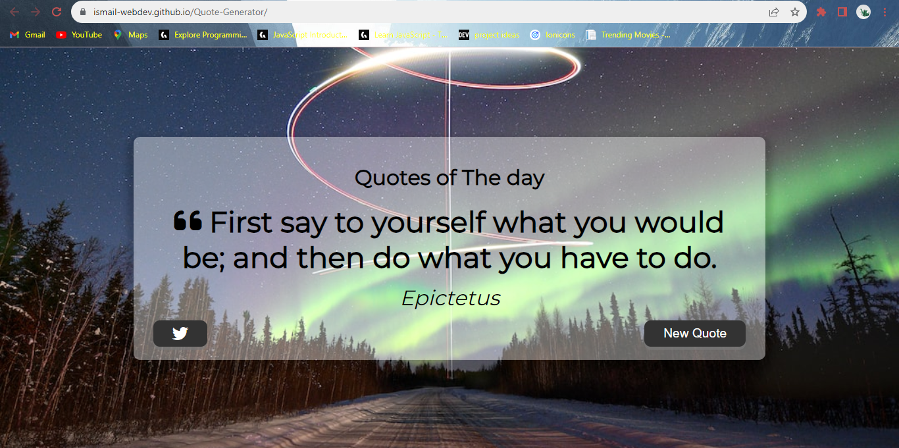
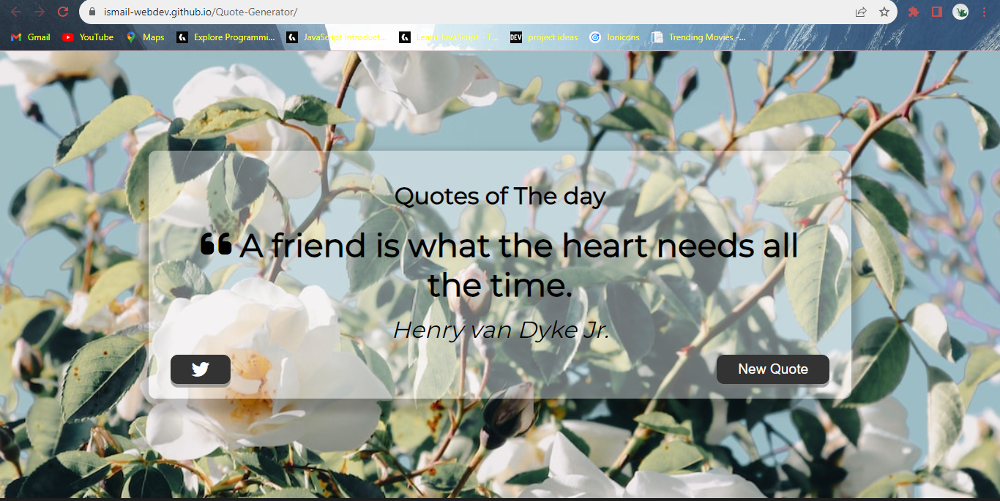

# Quote Generator

A simple and elegant web app that generates random quotes and allows you to share them on Twitter. The app fetches quotes from [Quotable API](https://api.quotable.io/random) and uses beautiful background images from Unsplash API.

## Live Demo

Check out the live demo [here](https://ismail-webdev.github.io/Quote-Generator/).

## Features

- 📜 Random quote generation from Quotable API.
- 🖼️ Background images from Unsplash API.
- 🐦 Share quotes on Twitter with a single click.
- 🌐 Responsive design for a seamless experience on all devices.

## Screenshots




## Usage

1. Visit the [live demo](https://ismail-webdev.github.io/Quote-Generator/).
2. Click the "New Quote" button to get a new inspiring quote.
3. Enjoy the beautiful background image that complements the quote.
4. Click on the Twitter icon to share the quote on your Twitter account.

## Development

To run the project locally, follow these steps:

1. Clone the repository:

   ```bash
   git clone https://github.com/Ismail-webdev/Quote-Generator.git
